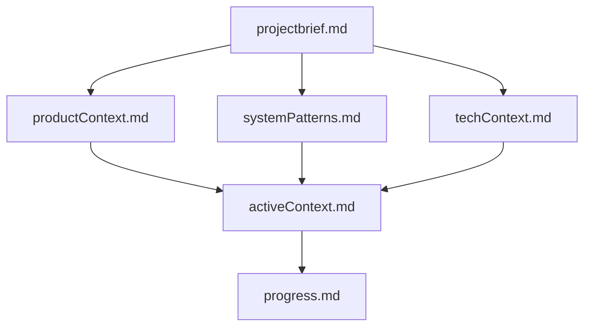
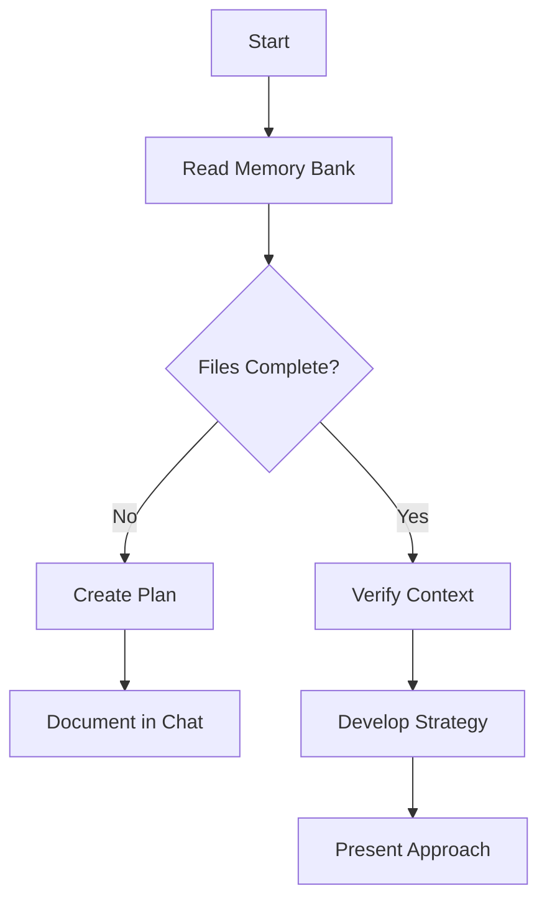
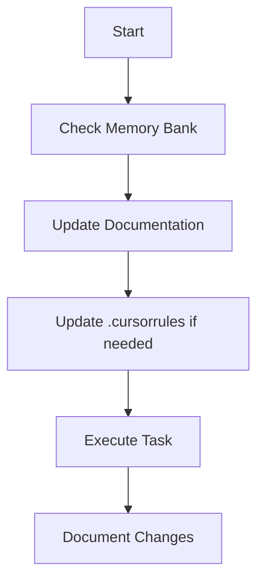

# Cursor Project Rule: Blend-v1 Memory Bank & Modular Component System

## Memory Bank-Driven Workflow

- **MANDATORY:** At the start of EVERY task, read ALL files in `memory-bank/` to reconstruct project context. This is non-negotiable and applies to all planning, coding, and documentation work.
- The Memory Bank is the single source of truth for project requirements, context, architecture, technical decisions, and progress.
- `.cursorrules` is a living document: update it with new patterns, preferences, and project intelligence as they emerge.

## Memory Bank Structure & Hierarchy

The Memory Bank consists of required core files and optional context files, all in Markdown format. Files build upon each other in a clear hierarchy:



### Core Files (Required)
1. `projectbrief.md` — Foundation document, core requirements, goals, scope
2. `productContext.md` — Why the project exists, problems solved, UX goals
3. `activeContext.md` — Current work focus, recent changes, next steps, active decisions
4. `systemPatterns.md` — Architecture, technical decisions, design patterns, component relationships
5. `techContext.md` — Technologies, setup, constraints, dependencies
6. `progress.md` — What works, what's left, current status, known issues

### Additional Context
- Create additional files/folders in `memory-bank/` for complex features, integrations, APIs, testing, deployment, etc.

## Core Workflows

### Plan Mode


### Act Mode


## Documentation Updates
- Update the Memory Bank when:
  1. Discovering new project patterns
  2. After significant changes
  3. When user requests with **update memory bank** (REVIEW ALL FILES)
  4. When context needs clarification
- Focus on `activeContext.md` and `progress.md` for current state.

## Project Intelligence (.cursorrules)
- `.cursorrules` is a learning journal for project-specific patterns, preferences, and intelligence.
- Capture:
  - Critical implementation paths
  - User preferences and workflow
  - Project-specific patterns
  - Known challenges
  - Evolution of project decisions
  - Tool usage patterns
- Format is flexible: prioritize clarity and actionable insights.

## Planning
- When entering "Planner Mode" or using `/plan`, deeply analyze the requested changes and the current codebase.
- Ask 4-6 clarifying questions before proposing a plan.
- Draft a comprehensive plan and get user approval before implementation.
- After each phase, document what was completed and what remains.

## Modular Component System (Blend-v1 Specific)
- All components must follow the modular directory and file structure as documented in `component-planning.md`.
- Foundation tokens are the single source of truth for design primitives.
- All new components and changes must be documented in the Memory Bank.
- Consistency, scalability, and maintainability are top priorities.

---

**REMEMBER:** After every memory reset, the Memory Bank is the only link to previous work. Maintain it with precision and clarity—your effectiveness depends on its accuracy.

## 1. Directory Structure & File Roles
- Each component must reside in its own directory under `lib/components/ComponentName/`.
- Required files:
  - `Component.tsx`: Main React component logic.
  - `StyledComponent.tsx`: All styled-components definitions.
  - `token.ts`: Component-specific design tokens, referencing `foundationToken.ts`.
  - `types.ts`: All TypeScript types, enums, and interfaces for the component.
  - `componentUtils.ts`: Utility functions for style computation, logic, etc.
  - `index.ts`: Barrel file exporting the main component (and types if needed).

## 2. Best Practices for Code Quality
- **Type Safety:** All files must use TypeScript. All props, enums, and utility function signatures must be explicit.
- **Separation of Concerns:** UI logic, styling, tokens, types, and utilities must be in separate files.
- **Reusability:** Utility functions and tokens should be generic and composable. Avoid hardcoding values.
- **Readability:** Use descriptive names, add comments for complex logic, and keep files focused and concise.
- **Extensibility:** Use enums for variants, sizes, and subtypes. Design tokens/types for easy extension.
- **Testing:** Utilities and tokens should be testable in isolation.
- **Accessibility:** All components must consider ARIA attributes and keyboard navigation.

## 3. Rules for Writing Component Tokens
- All component tokens must reference `foundationToken.ts` for colors, spacing, etc.
- Tokens must be organized by state (default, hover, disabled) and by type (primary, secondary, etc.).
- Use nested objects for scalability (e.g., `background.primary.default`).
- Maintain consistent naming and structure across all components.
- Add comments for non-obvious token choices.

## 4. Naming Conventions
- PascalCase for component and file names (except utils/tokens/types which are camelCase).
- Utility, token, and type files must be prefixed with the component name for clarity (e.g., `buttonUtils.ts`).

## 5. Example Directory
```
lib/components/ComponentName/
  ├── ComponentName.tsx
  ├── StyledComponentName.tsx
  ├── token.ts
  ├── types.ts
  ├── componentNameUtils.ts
  └── index.ts
```

## 6. Imports
- All imports must be relative within the component directory.
- Use the index file for external imports.

## 7. Extending Components
- To create a new component, copy the structure, update tokens/types, and implement the new logic.
- Always reference `foundationToken` for design consistency.

## 8. Foundation Token Example
```ts
// token.ts
import { foundationToken } from '../foundationToken';

const componentNameTokens = {
  background: {
    primary: {
      default: foundationToken.colors.primary[500],
      hover: foundationToken.colors.primary[600],
      disabled: foundationToken.colors.primary[200],
    },
    // ... other types
  },
  // ... other token categories
};
export default componentNameTokens;
```

## Best Practices for CSS and Styling

### Box Sizing and Dimensions
- Always use `box-sizing: border-box` for all component elements to ensure consistent dimensions.
- Add this to the base styles of components or in a styled-component's global style.
- This ensures borders and padding are included in the element's dimensions, preventing unexpected layout shifts.

### Border Handling
- For components with multiple variants, apply borders consistently across all variants.
- Use transparent borders for variants that don't need visible borders rather than conditionally adding borders.
- This ensures consistent dimensions and prevents height mismatches between variants.
- Example pattern:
```ts
// Good: Consistent border approach
border: 1px solid ${variant === 'filled' ? 'transparent' : borderColor};

// Avoid: Conditional borders that affect dimensions
${variant !== 'filled' && `border: 1px solid ${borderColor};`}
```

### Font Consistency
- Use CSS variables for font families and letter spacing to ensure consistency.
- Apply the same font styling rules across all components.
- Store font-related values in the token system for easy updates.

### Split Components
- When creating split components (like SplitTag), ensure both sections maintain consistent heights.
- Use negative margins sparingly and only when necessary to create seamless connections.
- Support different variants for different sections while maintaining visual consistency.

---

**All new components must follow this rule to ensure modularity, maintainability, and consistency across the library.** 